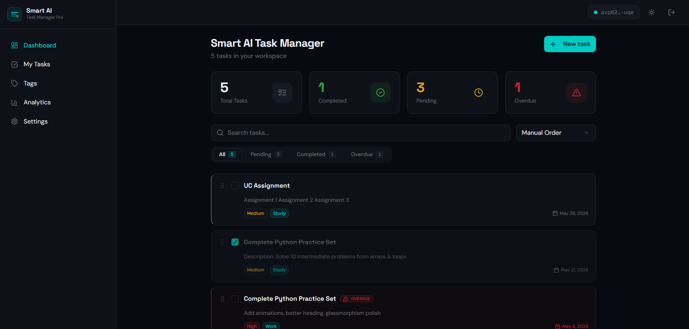

# 🤖 Smart AI Task Manager


A premium, production-ready AI-powered task management app built on the Internet Computer. Inspired by the best of Notion, Linear, and Todoist — with smart suggestions, drag-and-drop reordering, priority tracking, and a beautiful dark mode.

---

## 📸 Screenshots

### Homepage



### My Tasks


### Tags


---

## ✨ Features

- 🔐 **Authentication** — Secure sign-in/sign-out with Internet Identity
- ✅ **Task Management** — Create, edit, and delete tasks with ease
- 🎯 **Priority System** — Low, Medium, and High priority labels
- 🏷️ **Tag System** — Organize tasks with Work, Study, and Personal tags
- 💡 **Smart Suggestions** — AI-powered input completions as you type
- 🖱️ **Drag-and-Drop Reordering** — Intuitive task ordering with smooth animations
- 🌙 **Dark Mode Toggle** — Instant light/dark switching with a single click
- 📊 **Dashboard Stats** — At-a-glance view of Total, Completed, Pending, and Overdue tasks
- 🔍 **Real-Time Search** — Instantly filter tasks as you type
- 🗂️ **Filter & Sort** — View tasks by All / Pending / Completed / Overdue; sort by date or priority

---

## 🛠️ Tech Stack

| Layer | Technology |
|-------|------------|
| Frontend | React 19 + TypeScript |
| Styling | Tailwind CSS + shadcn/ui |
| Animations | motion/react |
| State | React Query (TanStack) |
| Backend | Motoko (Internet Computer) |
| Auth | Google |
| Deployment | Internet Computer (ICP) |

---

## 🚀 Getting Started

```bash
# Install dependencies
pnpm install

# Start local development
pnpm dev

# Deploy to the Internet Computer
caffeine deploy
```

> **default local login:

Email: admin@example.com
Password: admin123 **

---

## 🔮 Future Improvements

- 📋 **Kanban Board View** — Visual drag-and-drop board layout
- 🔁 **Recurring Tasks** — Automate repeated tasks on a schedule
- 👥 **Collaborative Sharing** — Share task lists with teammates
- 🎨 **Per-Tag Color Themes** — Custom color coding per tag category

---

## 📄 License

created by prasad-06
